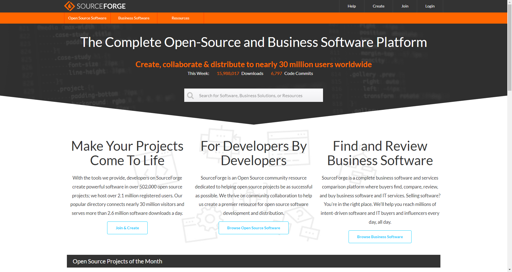

# Real website comparison - SourceForge and PiHut

### SourceForge
Owned by Slashdot Media

**Intended Uses**
- Open source software development and distribution
- Collaborative development for developers and businesses

**Features**
- A clean but verbose appearance
- Search for project by name
- Browse projects by category
- A mostly black and white colour palatte with a hint of orange
- Project star rating system
- Customer support via tickets
- Project update nofifications and mailing lists
- Account system for reviews
- Ticket system for bug reports and feature requests

### The PiHut
Owned by Mann Enterprises LTD

**Intended Uses**
- A storefront for Raspberry Pi single board computers and other small computers
- A resource for tutorials and guides on the products they sell

**Features**
- A navbar with dropdown menus allowing easy showcase of product categories 
- Responsive product pages
- Currency conversion
- Support article portal
- Accounts 
- A newsletter delivered via email

## Feature Review
### SourceForge
> Search for project by name

Improves usability and accessibility by allowing any item on the website to be easily searched for immediately 
> A clean but verbose appearance

Improves presentation by showing a lot of information while also being nice to look at

### The PiHut
> Responsive product pages

Improves accessibility by providing image magnification alongside clear, high resolution imagery of the product in question
> Currency conversion

Improves accessbility for worldwide shoppers by outright showing the cost for them instead of the customer having to convert the currency themselves
> Accounts

Improves usability by letting customers provide reviews and save payment information for frequent customers

## Strengths and Weaknesses
### SourceForge
**Strengths**
- Provides a good platform for developers in both independent and enterprise sectors
- Good colour scheme, orange isn't usually associated with computers or software but with the light association with orange code markers in an IDE justifies the choice from the owners of SourceForge, seeing as they're making a site "for developers, by developers"
- Provides a wide array of features along with just being a software distribution site, such as tickets, reviews and mailing lists

**Weaknesses**
- Their customer service has no live chat feature, instead you must send an email and wait up to 2 days for a ticket response.
- Developer profiles don't seem to have any ability to link a social profile or provide any direct contact point

### The PiHut
**Strengths**
- Covers the niche of single board computer projects in a well executed manner
- Support portal contains tens of articles related to common support issues
- Large resource portal containing tutorials and guides for projects with products sold on the site

**Weaknesses**
- No live chat support feature, you must submit a ticket and await a response
- Email newsletters are quite outdated nowadays