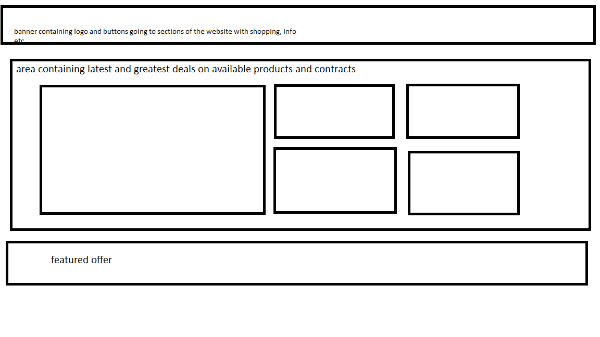
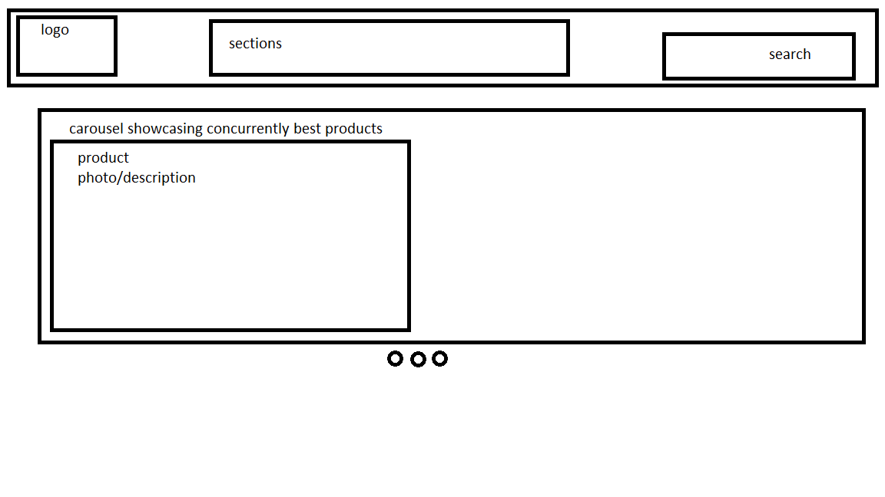
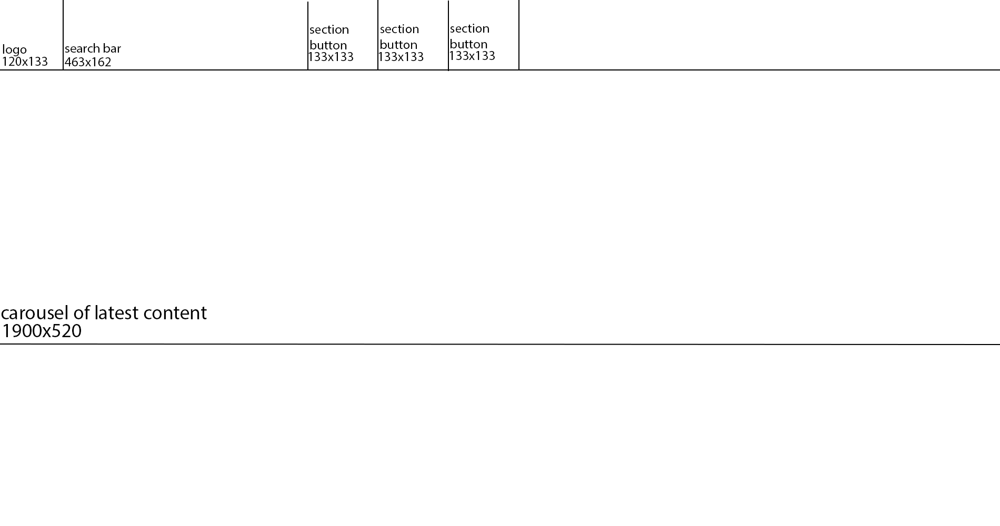

# Design Overview
## Design 1

+ The first rough design I came up with
+ Includes a basic navbar 
+ Includes a lot of condensed listings and information
+ Listings were to be static with no movement
+ Resembles a basic online store

## Design 2 (CHOSEN)

+ This is the closest storyboard to the design I opted with
+ Includes a carousel rather than static content
+ Final website design was still heavily altered from this, cutting the search bar from the navbar and adding content below the carousel
+ Also resembles a basic online storefront, I believe it is a formula that doesn't require much change.

+ Alternate storyboard for Design 2, also showing the cut search bar
+ I improvised most of the website from my rough storyboards, which I belive worked in my favor this time, but future projects most definitely need more planning