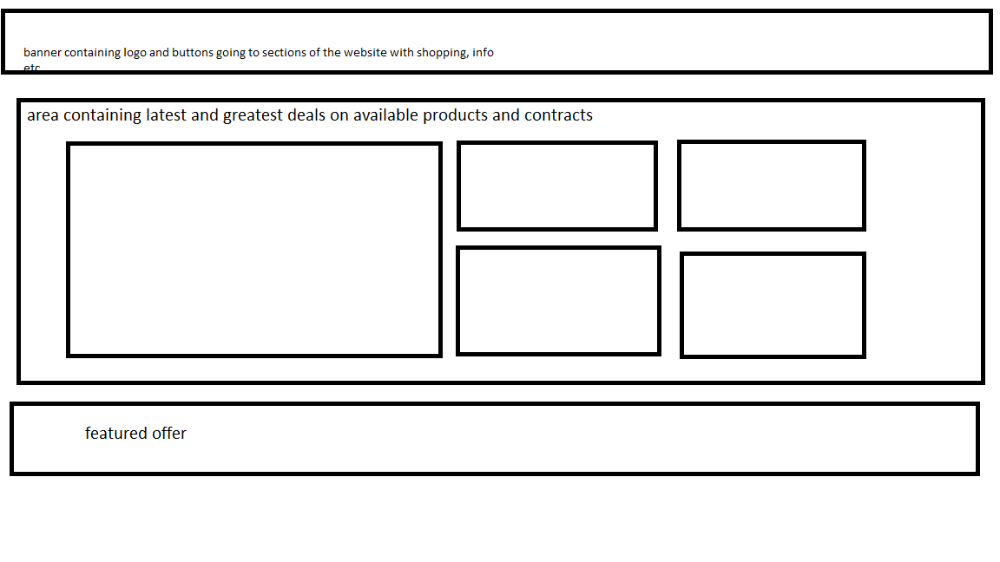
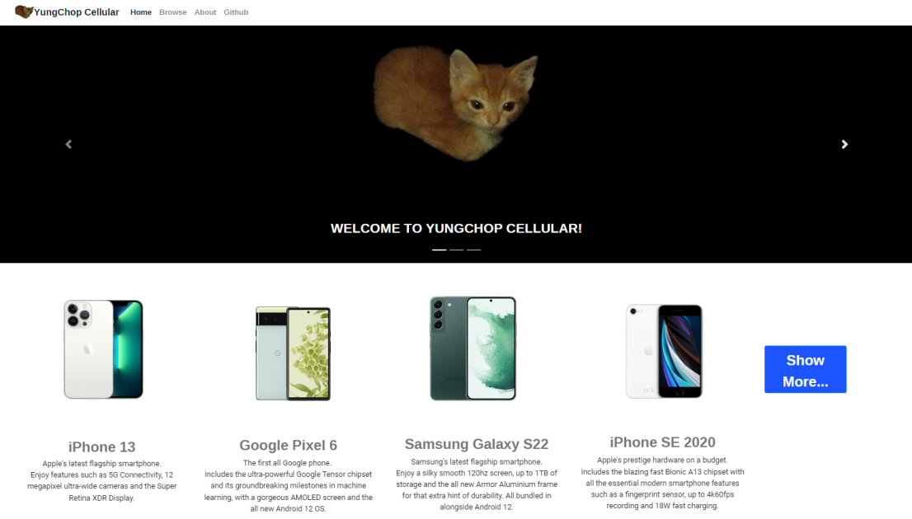

## Justification for final website towards user and client requirements according to brief
My design meets its target audience requirements (phone buyers), purpose and client requirements by:
1. Providing a front for promotion and sale of mobile phones.

A range of mobile phones are listed on the website as available for purchase, with a short tagline beside some products (sometimes the smallest nudges can win over a sale)

2. Having an interface that is quick and easy to navigate

Navigable areas are clearly marked by being spaced out on a navbar, highlighted as hyperlinks or highlighted by blue backgrounds as buttons.

3. Targetting people who would be interested in buying mobile phones

While listing new/popular products with plenty of information and photos of and about these products, the minimalist style of the website can also target phone buyers (look at Apple's branding and ads!)

4. Ensuring the design was consistent in text, colour and page style

 
The website had consistency in all of these aspects. It stuck to the same few fonts without deviating. In terms of colour, I stayed consistent with the risky notions on minimalism I took from the start of the project across the final website: that product imagery can fill in a colourless void, so all page colours maintained a dominant background colour of white with an exception of an image on the homepage carousel. The style of the product pages themselves followed a template where the only content that changed was product information, so every product page had the same layout for consistency.

5. Being interesting and including multiple pieces of embedded multimedia 

The site contained plenty of images but not much variety in media format (videos are embedded in resubmission) and while interest is subjective, I think branding the website around a cat is interesting in an absurdist sense.

6. Interactive features (e.g. a customer inquiry form)

The "About" page contained social media buttons which led to other pages but would count as customer inquiry forms if this was a real world website with actual social media pages. A Microsoft Form is added in resubmission to ensure a layer of *actual* user interaction.

7. Containing hyperlinks to other interesting webpages

There wasn't much of this rather than a YouTube video and a tweet in the "About" section social media buttons. I may work this part out in resubmission (potentially a button leading to an external site containing product reviews)

8. Each webpage should be internally linked, with easy to navigate menus

Every webpage is stored alongside one another, as is the media on each page. The only content held on a CDN are behind the scenes; the Bootstrap prerequisite scripts required for most elements on the site to display. The closest to a menu the site contains is the navbar, which is very simple to navigate.

9. The design should be responsive, and work on a mobile phone as well as a desktop (mobile first)

The design is certainly responsive, with satisfying format cues in each click (that isn't a redirect) showing that a button does something (along with doing the thing it needs to.)
I didn't adapt the site to work on mobile devices, if there is time in the remains of my resubmission period I will attempt to do this.
## Concept v. Final
### Concept

### Final

**How they compare**

There is a mix of aspects changed and aspects kept from design to final.

Firstly, the box in the middle, planned to have a number of products on display, was changed to a carousel.
I think the carousel works better, as a smoother albeit smaller showcase of products would be less cluttered than the previous idea.

Secondly, there was going to be a singular "featured offer" banner at the bottom showcasing one product, I later changed this to a small group of cards showcasing multiple products alongside a button that leads to the "Browse" page.

In retrospective, this feature acts as an alternate version of the first changed feature, just moved down the page a little bit and instead of showing 5-6 items, it is shortened to just 4 with plenty of space between them for less clutter.

The rest of the changes from design to final are minor, consisting of elements from the navbar being cut. Such as a shopping cart and search bar I had thought of doing with this particular design. I decided against these as a shopping cart is outside of my current skillset in web development and I deemed a search bar unnecessary in the scope of what is a rather small website.